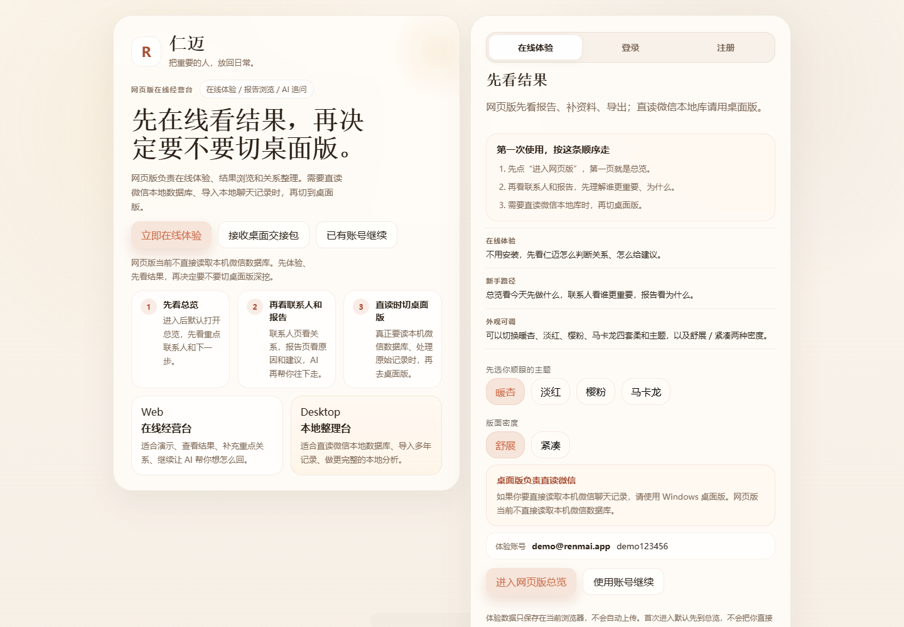
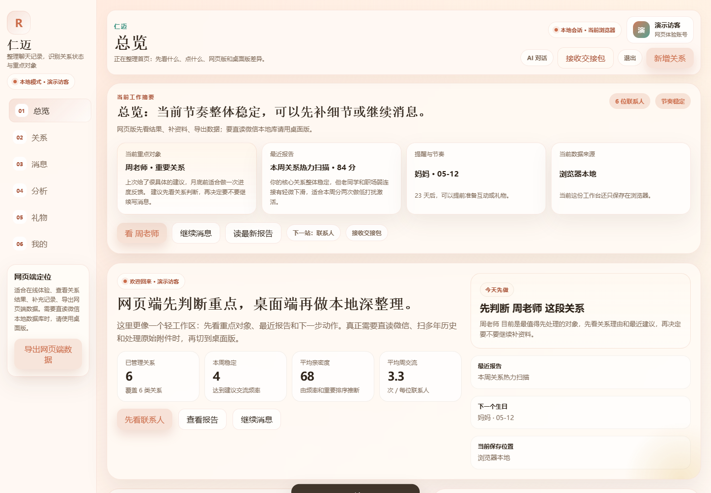
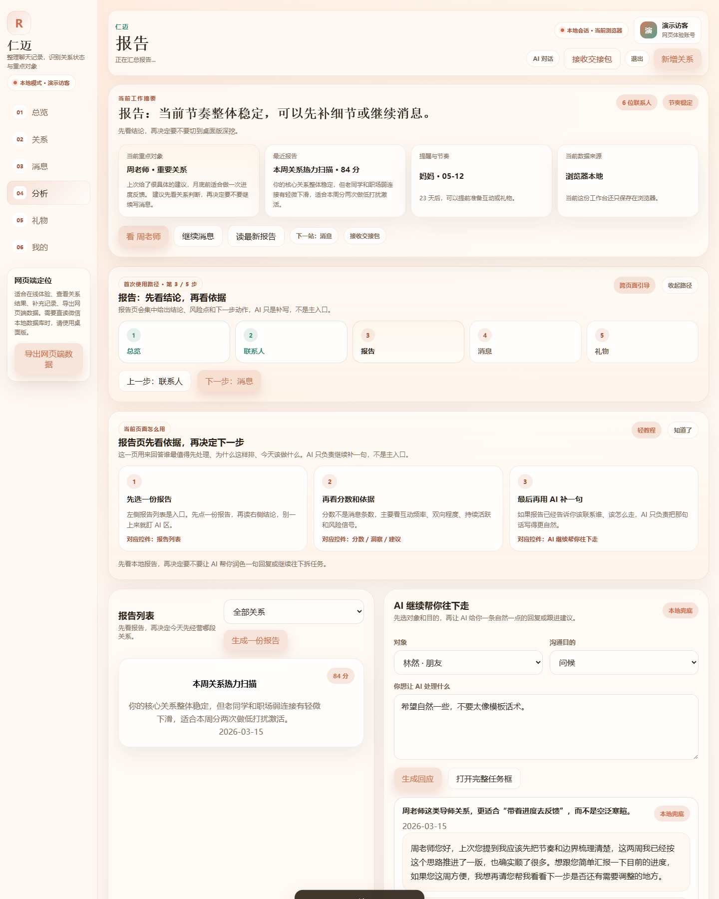
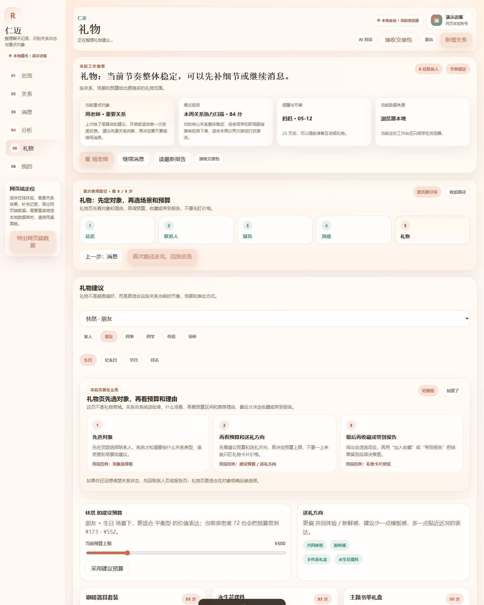

<div align="center">
  

  <h1>仁迈 GitHub Package</h1>

  <p><strong>中文</strong>：一个面向关系经营的桌面端与网页端组合包，支持聊天记录整理、关系分析、礼物建议与 AI 追问。</p>
  <p><strong>English</strong>: A relationship-intelligence workspace package with desktop source, Windows runnable build, web preview, gift suggestions, and AI follow-up support.</p>

  <p>
    
    
    
    
    
    
  </p>

  <p>
    <a href="#overview">Overview</a> ·
    <a href="#screenshots">Screenshots</a> ·
    <a href="#features">Features</a> ·
    <a href="#download-guide">Download Guide</a> ·
    <a href="#repository-layout">Repository Layout</a> ·
    <a href="#changelog">Changelog</a>
  </p>
</div>

---

<h2 id="overview">项目简介 / Overview</h2>

**中文**

仁迈是一个围绕“关系整理与持续经营”设计的产品组合包。这个仓库同时提供 Flutter 桌面端源码、Windows 可执行包和 Web 预览版本，适合继续开发、内部交付、演示展示和试用分发。

从当前源码和页面结构来看，项目核心能力集中在聊天记录整理、重点联系人识别、关系分层、报告生成、礼物建议，以及桌面端与网页端之间的协同使用流程。

**English**

Renmai is a relationship-management product package built around conversation organization and ongoing relationship maintenance. This repository includes the Flutter desktop source, a runnable Windows package, and a web preview for demos, internal delivery, and continued development.

Based on the current source code and UI flows, the product focuses on message organization, relationship scoring, key-contact prioritization, report generation, gift suggestions, and desktop-to-web handoff workflows.

<h2 id="screenshots">首页截图展示区 / Screenshots</h2>

> 以下截图来自仓库内置的 Web 预览演示数据。
>
> Screenshots below are captured from the built-in web preview demo data.

<table>
  <tr>
    <td align="center" width="50%">
      
      <br />
      <strong>欢迎页 / Landing</strong>
    </td>
    <td align="center" width="50%">
      
      <br />
      <strong>总览工作台 / Dashboard</strong>
    </td>
  </tr>
  <tr>
    <td align="center" width="50%">
      
      <br />
      <strong>报告分析 / Analysis</strong>
    </td>
    <td align="center" width="50%">
      
      <br />
      <strong>礼物建议 / Gift Suggestions</strong>
    </td>
  </tr>
</table>

<h2 id="features">核心能力 / Core Features</h2>

**中文**

- 聊天记录整理与导入，支持 `txt`、`html`、`htm`、`zip` 以及包含记录文件的目录。
- 关系分析与联系人排序，帮助识别更值得优先维护的对象。
- 重点关系报告、风险提示、行动建议与礼物建议。
- 可选的 AI 增强能力，用于在本地分析基础上继续补充建议或润色回复。
- 网页端用于在线看结果、补资料、导出数据，桌面端用于更完整的本地整理和处理。
- 提供主题与密度切换、工作台导航、交接包流转等产品化体验。

**English**

- Chat import and normalization for `txt`, `html`, `htm`, `zip`, and chat-record folders.
- Relationship analysis and contact ranking to identify who deserves attention first.
- Reports, risk hints, action suggestions, and gift recommendation flows.
- Optional AI enhancement to extend local analysis and help generate follow-up wording.
- Web preview for browsing results and lightweight organization, desktop for deeper local workflows.
- Product-oriented UX touches such as theming, display density, guided paths, and desktop/web handoff.

<h2 id="download-guide">下载指引区 / Download Guide</h2>

**中文**

GitHub 目前没有单独发布 Release 安装包，所以最简单的下载方式是直接下载整个仓库 ZIP，再按需要取出对应目录。

**English**

There is no dedicated GitHub Release package yet. The easiest way to download is to grab the repository ZIP and then use the folder you need.

**统一下载入口 / Main ZIP**

- [Download repository ZIP](https://github.com/tianhaoxiao99-ai/renmai-github-package/archive/refs/heads/main.zip)

| 使用目标 | 推荐目录 | 说明 |
| --- | --- | --- |
| 只想运行 Windows 版本 | [`windows/renmai_windows`](./windows/renmai_windows) | 下载整个仓库 ZIP 后，进入这个目录并运行 `renmai.exe`。当前目录体量约 110.8 MB。 |
| 想继续开发源码 | [`source/renmai_src_ascii`](./source/renmai_src_ascii) | Flutter 桌面端主源码目录，适合继续开发和维护。当前目录体量约 4.7 MB。 |
| 想快速看网页界面 | [`web/renmai_web_preview`](./web/renmai_web_preview) | 下载后可直接打开 `index.html` 预览，也可部署到静态托管。当前目录体量约 0.9 MB。 |
| 想看交付归档 | [`desktop_3_renmai`](./desktop_3_renmai) | 包含阶段性交付内容，适合留档或对照。 |

### Windows 运行方式 / Run the Windows build

```text
windows/renmai_windows/renmai.exe
```

### 源码运行方式 / Run from source

```bash
cd source/renmai_src_ascii
flutter pub get
flutter run -d windows
```

### Web 预览方式 / Web preview

```text
web/renmai_web_preview/index.html
```

如果你要做更稳定的网页预览，建议把 `web/renmai_web_preview` 目录部署到静态托管环境。

If you want a more stable web preview, deploy `web/renmai_web_preview` to a static hosting service.

<h2 id="repository-layout">仓库结构 / Repository Layout</h2>

| 路径 | 中文说明 | English |
| --- | --- | --- |
| [`source/renmai_src_ascii`](./source/renmai_src_ascii) | Flutter 桌面端源码 | Flutter desktop application source |
| [`windows/renmai_windows`](./windows/renmai_windows) | Windows 可执行包 | Runnable Windows package |
| [`web/renmai_web_preview`](./web/renmai_web_preview) | Web 预览版本 | Web preview build |
| [`desktop_3_renmai`](./desktop_3_renmai) | 阶段性交付归档目录 | Archived delivery bundle |
| [`README_GITHUB_UPLOAD.md`](./README_GITHUB_UPLOAD.md) | 原始上传与打包说明 | Original upload/package note |
| [`CHANGELOG.md`](./CHANGELOG.md) | 版本更新说明 | Version and repository history |

<h2 id="tech-stack">技术栈 / Tech Stack</h2>

- Flutter
- Provider
- Dio
- Shared Preferences
- Flutter Secure Storage
- HTML / CSS / JavaScript

**当前应用版本 / Current app version**

- `v1.0.0`
- `pubspec.yaml` version: `1.0.0+1`

<h2 id="changelog">版本更新说明 / Changelog</h2>

当前仓库把“应用版本”和“仓库展示更新”区分开写：

- 应用版本：目前公开可识别的应用版本仍是 `v1.0.0`
- 仓库展示更新：本次补充了截图区、中英双语 README、下载指引和更完整的版本说明

完整内容请看 [`CHANGELOG.md`](./CHANGELOG.md)。

For the full release and repository history, see [`CHANGELOG.md`](./CHANGELOG.md).

<h2 id="privacy">隐私与上传说明 / Privacy Notes</h2>

**中文**

- 仓库已排除 `RenmaiData/` 等本地运行数据目录，避免把个人本机数据直接上传到 GitHub。
- 当前 `.gitignore` 已忽略 `.dart_tool`、`build`、`output` 和 `windows/flutter/ephemeral` 等常见构建缓存。
- 这份根目录 `README.md` 用于首页展示，原始打包说明保留在 [`README_GITHUB_UPLOAD.md`](./README_GITHUB_UPLOAD.md)。

**English**

- Local runtime data such as `RenmaiData/` is excluded to avoid uploading personal machine data.
- The current `.gitignore` already ignores common build caches such as `.dart_tool`, `build`, `output`, and `windows/flutter/ephemeral`.
- This root `README.md` is meant for repository presentation, while the original packaging note remains in [`README_GITHUB_UPLOAD.md`](./README_GITHUB_UPLOAD.md).
