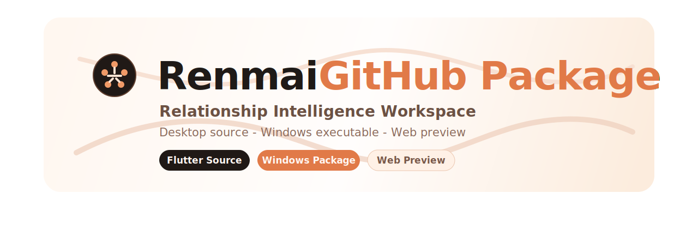

<div align="center">
  

  <h1>仁迈 GitHub Package</h1>

  <p>一个面向关系经营的桌面端与网页端组合包，支持聊天记录整理、关系分析、礼物建议与 AI 追问。</p>

  <p>
    
    
    
    
    
  </p>

  <p>
    <a href="#项目简介">项目简介</a> ·
    <a href="#核心能力">核心能力</a> ·
    <a href="#仓库结构">仓库结构</a> ·
    <a href="#快速开始">快速开始</a> ·
    <a href="#技术栈">技术栈</a> ·
    <a href="#隐私与上传说明">隐私与上传说明</a>
  </p>
</div>

---

## 项目简介

仁迈是一个围绕“关系整理与持续经营”设计的应用组合包。当前仓库同时提供：

- Flutter 桌面端源码，适合继续开发与维护。
- Windows 可执行包，适合直接分发和本机运行。
- Web 预览版本，适合演示界面、查看结果和继续做 AI 追问。

从现有源码与页面信息来看，项目重点包括聊天记录分析、关系分层、重点联系人识别、礼物建议，以及桌面端与网页端之间的协同使用流程。

## 核心能力

- 聊天记录整理与分析：围绕关系状态、互动频率和后续动作做结构化整理。
- 关系视图与重点识别：帮助筛出更值得优先维护的人和接下来该做的事。
- 礼物建议与经营辅助：从关系上下文出发提供更合适的触达与送礼思路。
- 桌面端直读入口：更适合处理本地数据、导入聊天记录和继续深度整理。
- 网页端预览入口：更适合在线看结果、演示产品和继续向 AI 追问。
- 多主题与响应式体验：仓库中已经包含桌面端主题设置和网页端展示入口。

## 仓库结构

| 路径 | 说明 |
| --- | --- |
| [`source/renmai_src_ascii`](./source/renmai_src_ascii) | Flutter 桌面端源码 |
| [`windows/renmai_windows`](./windows/renmai_windows) | Windows 可执行包，包含运行所需文件 |
| [`web/renmai_web_preview`](./web/renmai_web_preview) | Web 预览版，可直接打开查看 |
| [`desktop_3_renmai`](./desktop_3_renmai) | 交付归档目录，保留阶段性交付内容 |
| [`README_GITHUB_UPLOAD.md`](./README_GITHUB_UPLOAD.md) | 原始上传说明与打包备注 |

## 快速开始

### 运行源码

```bash
cd source/renmai_src_ascii
flutter pub get
flutter run -d windows
```

### 运行 Windows 包

直接打开：

```text
windows/renmai_windows/renmai.exe
```

### 查看 Web 预览

直接打开：

```text
web/renmai_web_preview/index.html
```

## 技术栈

- Flutter
- Provider
- Dio
- Shared Preferences
- Flutter Secure Storage
- HTML / CSS / JavaScript

当前 Flutter 包描述为“聊天记录分析与送礼助手”，版本号为 `1.0.0+1`。

## 适合怎么用

- 如果你要继续开发产品，优先看 [`source/renmai_src_ascii`](./source/renmai_src_ascii)。
- 如果你要给别人直接试用，优先使用 [`windows/renmai_windows`](./windows/renmai_windows)。
- 如果你要快速演示产品界面或在线预览，优先打开 [`web/renmai_web_preview`](./web/renmai_web_preview)。

## 隐私与上传说明

- 仓库已排除 `RenmaiData/` 这类本地运行数据目录，避免把个人本机数据直接上传到 GitHub。
- 现有 `.gitignore` 已忽略常见构建缓存目录，例如 `.dart_tool`、`build`、`output` 和 `windows/flutter/ephemeral`。
- 当前上传包说明见 [`README_GITHUB_UPLOAD.md`](./README_GITHUB_UPLOAD.md)，而这份 `README.md` 主要承担仓库首页展示与项目介绍功能。

## 说明

如果你后面还想继续往“更像产品官网”的风格走，我可以继续帮你补：

- 首页截图展示区
- 中英双语 README
- 下载指引区
- 更完整的版本更新说明
